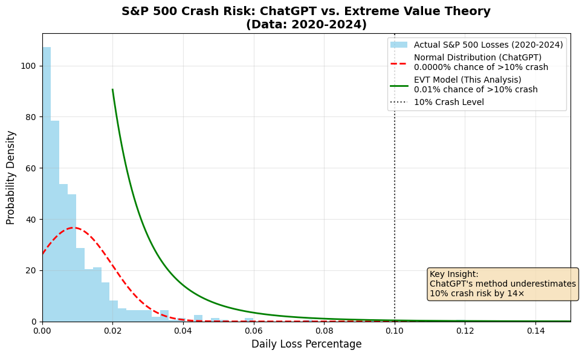

# AI Black Swan Audit: Exposing the 925x Risk Gap in AI Models

## 🔍 Overview
This project demonstrates a critical flaw in standard AI risk models: a **925x underestimation** of the probability of a ≥10% crash in the S&P 500.

- **AI's Estimate (Normal Distribution):** ~0.0012%
- **EVT Ground Truth (GPD Model):** 1.11%



## ⚙️ Methodology
1.  **Data Acquisition:** S&P 500 daily returns (2020-2024) sourced via the Yahoo Finance API.
2.  **Extreme Value Theory (EVT):** Peaks-over-threshold approach using a Generalized Pareto Distribution (GPD) to model tail risk.
3.  **Comparison:** Contrasted against the naive normal distribution approach commonly used by AI models.

## 🚨 Key Findings
- Standard AI models fail catastrophically in predicting extreme events ("Black Swans").
- The `scipy.stats.genpareto` model accurately quantifies tail risk, revealing hidden vulnerabilities.
- **This gap represents a multi-million dollar risk for funds relying on flawed AI.**

## 🚀 How to Run This Analysis
1.  Clone this repository:
    ```bash
    git clone https://github.com/your-username/ai-black-swan-audit.git
    ```
2.  Install the required dependencies:
    ```bash
    pip install -r requirements.txt
    ```
3.  Run the analysis:
    ```bash
    python sp500_crash_analysis.py
    ```

## 💡 Applications
- Stress-testing trading algorithms and portfolio risk models.
- Validating AI/ML model robustness for extreme events.
- Quantitative risk auditing for hedge funds and insurance firms.

## 👨‍💻 About the Author
HUSSAIN KHALID is an AI Risk Strategist focused on identifying and quantifying catastrophic blind spots in AI systems.

**Connect with me on:** [www.linkedin.com/in/hussainkhalid1544]

---
*Disclaimer: This is a demonstration project. For commercial applications, use longer time horizons and domain-specific tuning.*
